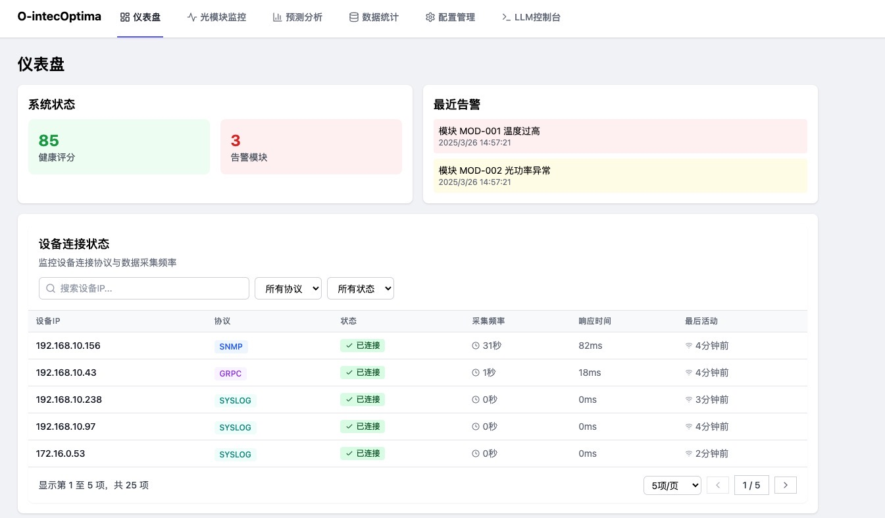
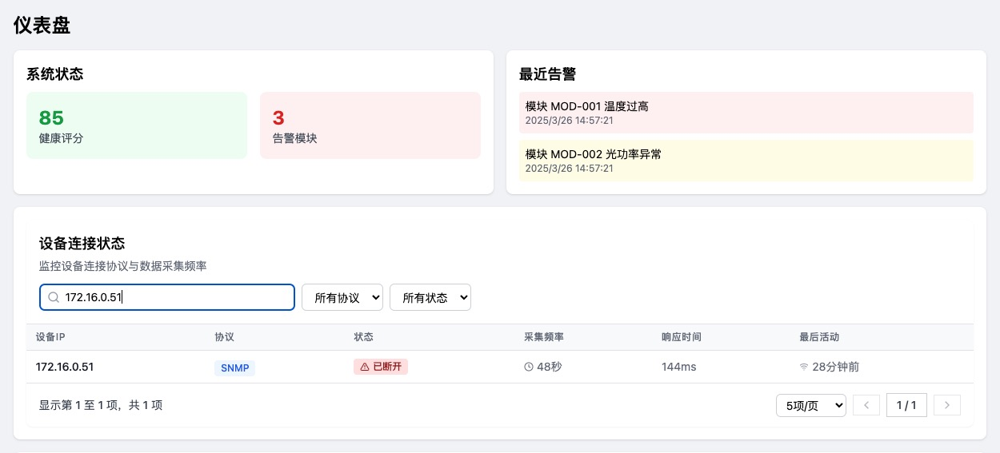
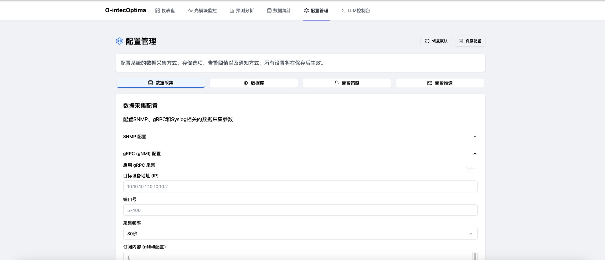
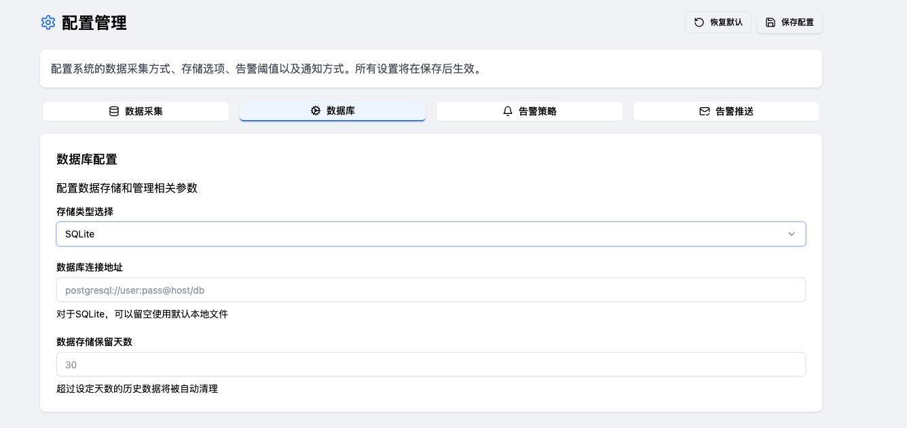

# O-Intec Optima - 光模块智能运维平台 (v1.0)

O-Intec Optima 是一个专为光模块监控和智能运维设计的综合平台，提供实时监控、异常检测、智能预测和配置管理等功能。

## 最近更新 (v1.0)

本次更新主要优化了用户体验，实现了设备连接状态与交换机面板的联动：

1. **设备选择优化**
   - 点击设备连接状态面板中的设备IP，自动选择对应设备
   - 交换机面板自动切换到选中的设备
   - 显示当前选中设备名称，提高使用体验

2. **设备映射功能**
   - 建立IP地址与设备ID的映射关系
   - 支持通过设备连接状态直接操作设备
   - 被选中设备高亮显示，状态一目了然

3. **交互体验改进**
   - 优化设备选择说明文本
   - 仅已连接设备可点击选择
   - 设备选择后保持状态

## 界面预览

### 设备连接状态面板


### 设备连接搜索与筛选功能


### 数据采集模块


### 数据库配置模块


### 告警策略


### 推送模块


## 主要功能

### 1. 实时监控
监控光模块的温度、电压、光功率、误码率等关键参数，提供实时可视化界面。

### 2. 异常检测
基于机器学习算法，对光模块运行异常进行智能识别和预警。

### 3. 预测分析
对光模块性能衰退趋势进行预测，提前通知可能的故障风险。

### 4. 配置管理
集中管理数据采集、存储、告警阈值和通知方式等系统配置。

## 技术栈

- **前端**: React + TypeScript + Tailwind CSS + Radix UI
- **后端**: Node.js + Express
- **数据库**: 支持多种数据库（SQLite, InfluxDB, TimescaleDB等）
- **数据采集**: 支持SNMP, gRPC(gNMI), Syslog等多种协议

## 安装与运行

```bash
# 安装依赖
npm install

# 开发环境运行
npm run dev

# 构建生产版本
npm run build
```

## 项目结构

```
src/
├── components/     # 组件库
│   ├── config/     # 配置相关组件
│   └── ui/         # 基础UI组件
├── pages/          # 页面组件
├── services/       # 服务层
└── lib/            # 工具函数
```

## 更新计划

1. 增强LLM智能诊断功能
2. 提供更丰富的数据可视化选项
3. 支持更多厂商设备的自动发现
4. 完善权限管理系统

## 贡献指南

欢迎提交问题和改进建议，或直接提交Pull Request。

## 项目简介

O-Intec Optima是一个专注于光模块智能运维的综合平台，旨在提供高效的光模块管理、监控和预测性维护解决方案。通过数据可视化、智能分析和预警系统，帮助网络运维团队提高光模块的可靠性和寿命，降低运维成本。

## 核心功能

- **仪表盘(Dashboard)**: 直观展示系统状态、设备选择、接口状态和交换机面板
- **光模块监控(Module Monitor)**: 实时监控光模块状态、性能参数和告警信息
- **预测分析(Predictive Analysis)**: 基于历史数据预测光模块寿命和潜在故障
- **数据统计(Analytics)**: 全面的数据分析功能，包括接口统计、模块统计、流量统计和预测分析
- **LLM控制台(LLM Console)**: 集成LLM模型，提供智能问答和辅助决策

## 技术栈

- 前端: React, TypeScript, Vite, TailwindCSS
- 后端: Node.js, Express
- 数据可视化: React Charts, Custom Components
- AI集成: LLM API集成

## 安装指南

### 前提条件

- Node.js v18+
- npm v9+

### 安装步骤

1. 克隆项目仓库
```bash
git clone https://github.com/qwert22356/o-intec-optima.git
cd o-intec-optima
```

2. 安装依赖
```bash
npm install
```

3. 启动LLM服务器（可选）
```bash
cd src/services/llm/server
npm install
npm start
```

4. 启动前端开发服务器
```bash
npm run dev
```

5. 访问应用
在浏览器中打开 http://localhost:5173 (或控制台显示的其他端口)

## 使用指南

### 仪表盘

仪表盘页面提供系统整体视图，包括：
- 系统状态和告警信息
- 设备选择区域
- 交换机面板可视化
- 接口状态详细信息

### 光模块监控

- 查看所有光模块的实时状态
- 通过视图按钮查看详细信息
- 使用过滤器筛选特定类型的模块
- 分页功能支持大量数据浏览

### 预测分析

- 查看光模块预测寿命和健康状况
- 管理预测规则和参数
- 通过分页控件浏览大量数据
- 生成预测报告和建议

### 数据统计

- 分析接口统计数据
- 查看光模块类型和状态分布
- 追踪流量趋势和峰值
- 查看预测统计数据

### LLM控制台

- 通过自然语言与系统交互
- 获取关于光模块的智能建议
- 进行复杂查询和分析

## 版本历史

- v1.0: 实现设备连接状态面板与交换机面板联动，点击设备IP可自动选择对应设备，优化用户交互体验
- v0.99: 添加设备连接状态监控面板，包含设备IP、协议类型、连接状态及采集频率，支持搜索筛选与分页功能
- v0.95: 修复透明下拉菜单，移除重复模型配置，优化gNMI配置界面，修复路由配置
- v0.92: 增强端口详情对话框，添加光模块厂商、序列号、零件号、温度、电压、电流、接收/发送功率和位置信息
- v0.91: 添加分页功能到模块预测页面、优化界面、修复路由问题
- v0.8: 重构页面布局，添加交换机面板可视化
- v0.7: 基础版本，实现核心功能

## 许可证

© 2025 O-Intec LLC. 保留所有权利。 
