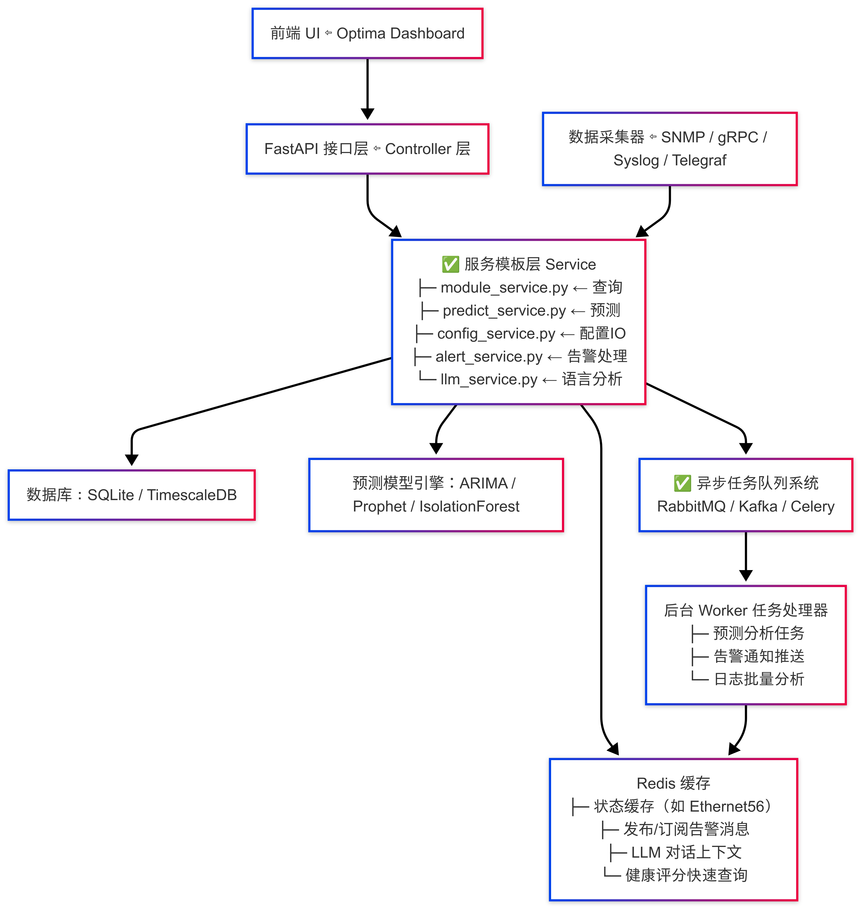
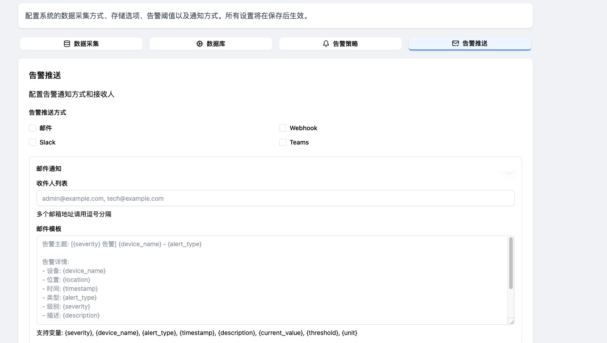

# O-intecOptima - 光模块智能运维平台



O-intecOptima 是一个专业的光模块智能运维平台，旨在提供全方位的光模块监控、预测性维护和智能分析服务。

## 最新版本 v1.51 更新内容

- 📊 **光模块统计功能升级**
  - 增加光模块厂商更换率对比分析，支持直观评估各厂商模块质量和不同速率性能
  - 支持多选1G/10G/25G/40G/100G/200G/400G/800G速率进行分析
  - 支持按月、季度、年为时间单位进行统计分析
  - 提供柱状图/折线图双视图，支持按时间维度灵活切换
  - 增加厂商/速率多选筛选功能，实现精准的数据过滤
  - 新增速率×厂商热力图，快速识别问题模块类型
  - 优化布局设计，模块类型分布和厂商分布使用更简洁的文本展示

## v1.5 更新内容

- 🚨 **高风险模块预测预警功能增强**
  - 实现"查看全部"功能，支持弹出高风险模块预测预警表
  - 支持按剩余时间/风险分数排序
  - 增加多维度搜索筛选（数据中心、机房、机柜、机架、设备、预计寿命）
  - 支持导出全部高风险模块数据（CSV/JSON格式）

## v1.4 更新内容

- ✨ **规则管理界面优化**
  - 改进了规则管理标签页的布局，采用两栏设计
  - 左侧显示规则列表，右侧显示规则统计信息
  - 优化了规则详情显示，提供更直观的信息展示
  
- 🔄 **功能交互优化**
  - 修复了点击规则后灰屏的问题
  - "刷新所有规则准确率"按钮功能优化
  - 完善了创建规则表单的响应机制

- 🧩 **用户体验提升**
  - 规则卡片设计更加直观
  - 准确率显示更加醒目
  - 整体界面布局更加合理

## 功能特点

- 📊 **实时监控**
  - 模块状态实时监控
  - 性能参数可视化
  - 告警实时推送

- 🔮 **预测性维护**
  - 故障预测分析
  - 寿命评估
  - 性能趋势分析

- 🤖 **智能分析**
  - 基于 LLM 的智能诊断
  - 自动化运维建议
  - 性能优化方案

- ⚙️ **配置管理**
  - 阈值配置
  - 告警规则设置
  - 系统参数配置

## 界面预览

### 设备连接状态面板


### 设备连接搜索与筛选功能


### 数据采集模块


### 数据库配置模块


### 告警策略


### 推送模块



## 主要功能

### 1. 实时监控

监控光模块的温度、电压、光功率、误码率等关键参数，提供实时可视化界面。

### 2. 异常检测

基于机器学习算法，对光模块运行异常进行智能识别和预警。

### 3. 预测分析

对光模块性能衰退趋势进行预测，提前通知可能的故障风险。

### 4. 配置管理

集中管理数据采集、存储、告警阈值和通知方式等系统配置。

## 技术架构

### 前端技术栈
- React + TypeScript
- Vite 构建工具
- TailwindCSS 样式框架
- 实时数据可视化组件

### 后端技术栈
- FastAPI / Express.js
- WebSocket 实时通信
- 时序数据库 (InfluxDB)
- SQLite 关系数据库

### AI/ML 集成
- ARIMA/IF 预测模型
- Prophet 时序预测
- ChatGPT/D5 API 集成

### 数据采集
- SNMP 协议支持
- gRPC 通信
- syslog 日志采集

## 模块 ID 命名建议（唯一定位模块）
统一命名格式：
```bash
<光模块厂商>-<数据中心>-<机房/Pod>-<机柜>-<交换机hostname>-<interface>-<speed>
```
例如：
```bash
CISCO-DC1-Pod01-Rack01-SW01-Eth1/1-100G
```
这样每条指标都能绑定唯一的光模块。

## 版本历史

- **v1.51** - 光模块统计功能升级
- **v1.5** - 高风险模块预测预警功能增强
- **v1.4** - 规则管理界面优化，用户体验提升
- **v1.0** - 首个稳定版本发布
- **v0.99** - 预发布版本
- **v0.95** - Beta测试版本
- **v0.9** - 功能完善阶段
- **v0.8** - 初始开发版本

## 快速开始

### 环境要求
- Node.js >= 18.0.0
- Python >= 3.8 (如果使用 FastAPI 后端)
- SQLite3

### 安装步骤

1. 克隆仓库
```bash
git clone https://github.com/qwert22356/o-intec-optima.git
cd o-intec-optima
```

2. 安装依赖
```bash
npm install
```

3. 启动开发服务器
```bash
npm run dev
```

4. 构建生产版本
```bash
npm run build
```

## 项目结构

```
o-intec-optima/
├── src/                    # 源代码目录
│   ├── components/        # React 组件
│   ├── pages/            # 页面组件
│   ├── services/         # API 服务
│   └── lib/              # 工具库
├── docs/                  # 文档
│   ├── api-requirements.md    # API 需求文档
│   └── architecture.md        # 架构文档
├── screenshots/           # 项目截图
└── public/               # 静态资源
```

## API 文档

详细的 API 文档请参考 [API 需求文档](docs/api-requirements.md)。

## 系统架构

详细的系统架构说明请参考 [架构文档](docs/architecture.md)。

## 开发计划

- [x] 前端 UI 开发完成
- [x] API 接口定义
- [x] 规则管理界面优化 (v1.4)
- [x] 高风险模块预测预警功能增强 (v1.5)
- [x] 光模块统计功能升级 (v1.51)
- [ ] 后端服务开发
- [ ] 数据采集模块
- [ ] AI 预测模型集成
- [ ] 系统测试与优化

## 贡献指南

欢迎提交问题和改进建议，或直接提交Pull Request。

## 许可证

© 2025 O-Intec Optima. 保留所有权利。
